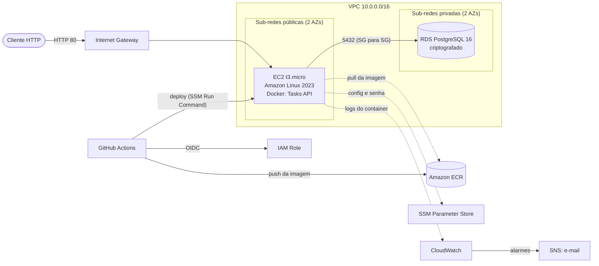

# Infraestrutura AWS com Terraform

[](https://github.com/Gxstein/aws-infra-terraform/actions/workflows/terraform.yml)
[](https://github.com/Gxstein/aws-infra-terraform/actions/workflows/app.yml)

Ambiente completo na AWS criado 100% como código (IaC) com **Terraform**: rede própria em duas zonas de disponibilidade, uma API REST em **Docker** rodando numa **EC2**, banco **PostgreSQL no RDS** isolado em sub-rede privada, segurança com **IAM** de menor privilégio, monitoramento com **CloudWatch** e entrega contínua com **GitHub Actions** autenticado por **OIDC** (sem chaves de acesso guardadas no GitHub).

O objetivo é praticar os fundamentos de infraestrutura em nuvem: rede, virtualização, segurança, observabilidade e controle de custos.

## Arquitetura



Mais detalhes em [docs/arquitetura.md](docs/arquitetura.md).

## O que cada parte faz

| Arquivo | Recursos | Para quê |
|---|---|---|
| `bootstrap/` | S3 versionado e criptografado | Guarda o *state* do Terraform com trava nativa (`use_lockfile`) |
| `terraform/network.tf` | VPC, 4 sub-redes, Internet Gateway, tabelas de rotas | Rede isolada: sub-redes públicas para a API e privadas, sem rota para a internet, para o banco |
| `terraform/security_groups.tf` | Security Groups | Firewall: porta 80 aberta só para a API; 5432 só da API para o banco; nenhuma porta 22 |
| `terraform/ecr.tf` | Amazon ECR | Registro privado da imagem Docker, com *scan* de vulnerabilidades e limpeza automática |
| `terraform/database.tf` | RDS PostgreSQL, SSM Parameter Store | Banco gerenciado e criptografado; senha gerada pelo Terraform e salva como `SecureString` (KMS) |
| `terraform/iam.tf` | IAM Role e Instance Profile | Permissões mínimas da EC2: SSM, pull no ECR, leitura dos próprios parâmetros e escrita de logs |
| `terraform/compute.tf` | EC2 e log group | Servidor com IMDSv2 obrigatório e disco criptografado; o *user data* instala o Docker e sobe a API |
| `terraform/monitoring.tf` | CloudWatch Alarms, SNS, VPC Flow Logs, AWS Budgets | Alertas de CPU, falha de hardware (com recuperação automática), disco do banco e custo mensal |
| `terraform/github_oidc.tf` | Provedor OIDC e IAM Role | Permite ao GitHub Actions acessar a AWS com credenciais temporárias |
| `app/` | FastAPI, Dockerfile, testes | API de tarefas (CRUD) usada para exercitar a infraestrutura |
| `.github/workflows/` | GitHub Actions | `terraform`: fmt, validate, Checkov e plan · `app`: testes, build, push no ECR e deploy |

## Segurança

- **Sem SSH**: a instância não tem par de chaves nem porta 22 aberta; o acesso é pelo **SSM Session Manager**, e cada sessão fica registrada no CloudTrail.
- **Sem chaves de acesso**: a EC2 usa *instance profile* e o GitHub Actions usa **OIDC**; nenhum segredo da AWS fica no repositório ou no GitHub.
- **Menor privilégio**: cada Security Group libera uma porta para uma origem; as políticas IAM apontam para ARNs específicos.
- **Criptografia**: RDS, disco da EC2 e *state* criptografados em repouso; conexão com o banco via TLS (`sslmode=require`); senha no Parameter Store como `SecureString` (KMS).
- **IMDSv2 obrigatório** na EC2, o que protege contra roubo de credenciais via SSRF.
- **Análise estática** com **Checkov** a cada mudança; as exceções aceitas estão justificadas em [docs/seguranca.md](docs/seguranca.md).

## Custos

Estimativa para `us-east-1` com tudo ligado 24 horas (preços on-demand, sem nível gratuito):

| Recurso | Aproximado por mês |
|---|---|
| EC2 t3.micro + 16 GB gp3 | US$ 8,90 |
| IPv4 público | US$ 3,65 |
| RDS db.t4g.micro + 20 GB gp3 | US$ 14,00 |
| ECR, CloudWatch, S3, SSM | menos de US$ 1,00 |
| **Total** | **cerca de US$ 27** |

Contas novas da AWS cobrem esse valor com os créditos do plano gratuito. Mesmo assim o **AWS Budgets** avisa por e-mail ao chegar em 80% do limite (padrão US$ 30) e quando a previsão do mês passar de 100%. Para não gastar à toa, rode `terraform destroy` quando não estiver usando o ambiente.

## Como executar

### Pré-requisitos

- Conta AWS e AWS CLI v2 configurada (`aws configure` ou `aws sso login`)
- Terraform 1.10 ou superior
- Plugin do Session Manager para a AWS CLI (só para abrir shell na instância)

### 1. Bucket do state (uma vez por conta)

```bash
cd bootstrap
terraform init
terraform apply
# anote a saída state_bucket_name
```

### 2. Ambiente principal

```bash
cd ../terraform
cp backend.hcl.example backend.hcl            # coloque o nome do bucket
cp terraform.tfvars.example terraform.tfvars  # seu e-mail e o nome do bucket

terraform init -backend-config=backend.hcl
terraform plan
terraform apply
```

Confirme o e-mail de inscrição do SNS que chega na sua caixa para receber os alarmes.

### 3. Primeiro deploy da API

Configure as variáveis do repositório no GitHub (próxima seção) e rode o workflow **app** (aba Actions, *Run workflow*). Ele testa, gera a imagem, envia para o ECR e faz o deploy na EC2.

```bash
curl "$(terraform output -raw api_url)/health"
# {"status":"ok","database":"up"}

curl -X POST "$(terraform output -raw api_url)/tasks" \
  -H "Content-Type: application/json" \
  -d '{"title": "Estudar VPC"}'
```

A documentação interativa da API fica em `/docs` (Swagger).

## CI/CD

| Workflow | Quando roda | O que faz |
|---|---|---|
| `terraform.yml` | PR ou push que mexe em `terraform/` ou `bootstrap/` | `terraform fmt`, `validate`, Checkov e, em PRs, `terraform plan` publicado no resumo do job |
| `app.yml` | PR ou push que mexe em `app/` | Testes com PostgreSQL real; no `main`: build, push no ECR (tags `latest` e SHA curto) e deploy via SSM Run Command, seguido de *smoke test* |

Variáveis do repositório (**Settings > Secrets and variables > Actions > Variables**), todas vindas de `terraform output`:

| Variável | Valor |
|---|---|
| `AWS_ROLE_ARN` | `github_actions_role_arn` |
| `AWS_REGION` | `us-east-1` |
| `ECR_REPOSITORY` | `ecr_repository_name` |
| `INSTANCE_ID` | `instance_id` |
| `TF_STATE_BUCKET` | nome do bucket do bootstrap |
| `ALERT_EMAIL` | seu e-mail |

Sem `AWS_ROLE_ARN`, os jobs que acessam a AWS são pulados e só a validação e os testes rodam.

## Desenvolvimento local

```bash
cd app
docker compose up --build        # API + PostgreSQL
curl localhost:8000/health

pip install -r requirements-dev.txt
pytest                           # testes unitários (sem banco)
```

## Estrutura

```
.
├── bootstrap/              # bucket S3 do state remoto
├── terraform/              # stack principal
│   └── templates/          # user data da EC2
├── app/                    # API FastAPI + Dockerfile + testes
├── docs/                   # arquitetura, segurança e operação
├── .github/workflows/      # pipelines de CI/CD
└── .checkov.yaml           # regras do scan de segurança
```

## Operação

Deploy, rollback, acesso à instância, logs e como destruir o ambiente: [docs/operacao.md](docs/operacao.md).

## Próximos passos

- Application Load Balancer com HTTPS (ACM) e Auto Scaling Group em duas AZs
- RDS Multi-AZ e autenticação no banco por IAM
- Módulos Terraform reutilizáveis e ambientes `dev` e `prod` separados
